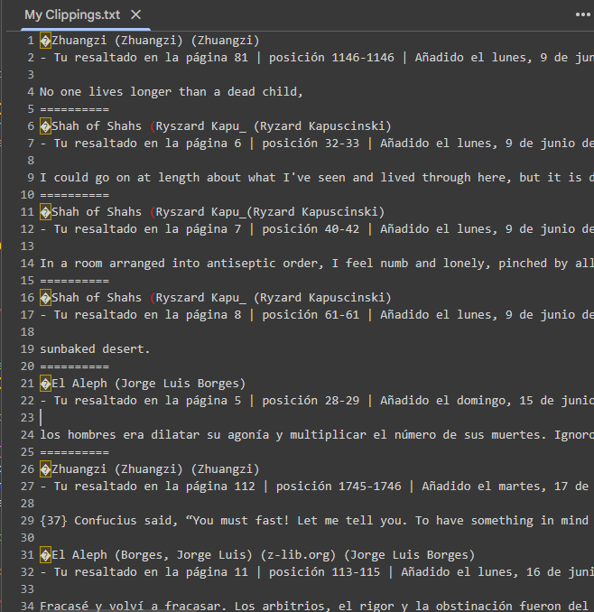
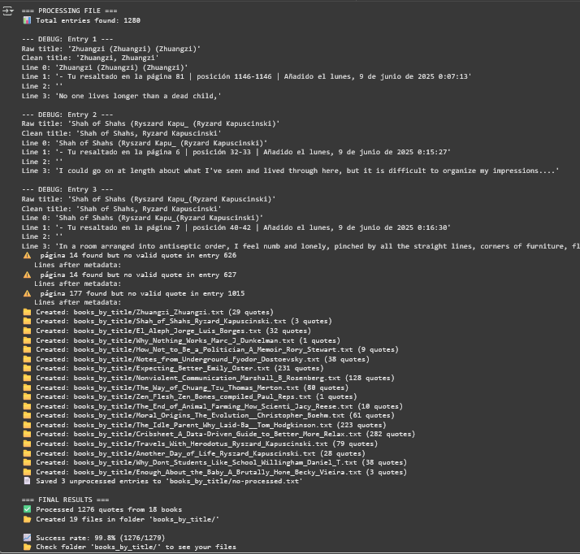
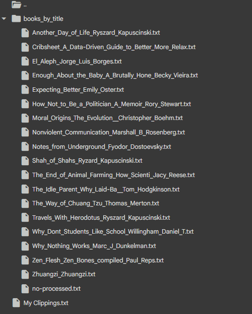

# Kindle Highlights Extractor

Extracts and organizes highlights/quotes from Kindle´s default verbose exported format into separate files per book.

## Problem
Kindle generates a file, My Clippings.txt, where it dumps highlights from all books that you read chronologically rather than by book, and adds long, unnecessary strings to your highlights bloating the content. I needed a way to quickly sort the highlights by book for future reference, and to erase Kindle´s additional metadata.


## Features
- Separates mixed highlights from multiple books that Kindle collects in My Clippings.txt by detecting the separator ==========
- Groups quotes by book title and arranges them by page vs chronologically
- Handles both long quotes and individual vocabulary words
- Sorts highlights by page number
- Erases unnecessary and repetitive information from the invidivual highlights
- Cleans invisible Unicode characters
- Creates one .txt file per book
- Shows stats and unprocessed entries
- Supports Roman (i, iv, xii, etc.) and Arabic (1, 4, 12, etc.) pagination
- Creates an extra output file called no-processed.txt with the highlights that couldn´t be processed
     

## Language Support

By default, the script looks for the word **“página”** (Spanish) to find page numbers or document´s position.
**To use with other languages**, edit this line at the top of the script `kindle_quotes_extractor.py`: 
Change these to match your export language
PAGE_KEYWORD = "página"      # e.g., "page", "Seite", "pagina"
POSITION_KEYWORD = "posición" # e.g., "location", "posizione", "Position"

## Requirements

- **Python 3.6 or higher**
- No external libraries required
Just clone and run!

## Quick Start

1. Your Kindle by default generates a file called My Clippings.txt, upload or move it to the same directory as kindle_quotes_extractor.py
2. Edit `PAGE_KEYWORD` in the script if your export is not in Spanish
3. Run:
   ```bash
   python kindle_quotes_extractor.py

## Before & After

### Before: Your `My Clippings.txt` (raw export)



> A messy, chronological list of highlights from multiple books.

### After: Organized, clean files per book



> Each book gets its own `.txt` file, sorted by page number — even Roman numerals!
> Entries that couldn’t be parsed are saved for manual review — no data loss! Check `no-processed.txt`




## Development
Developed with assistance from Claude AI and Qwen AI for refinement and implementation.
